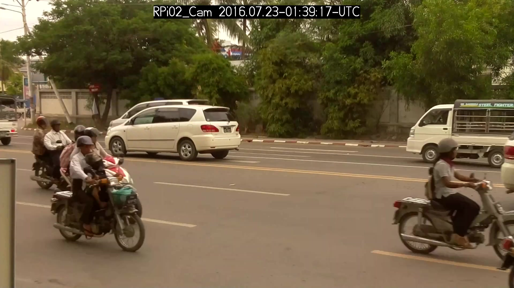
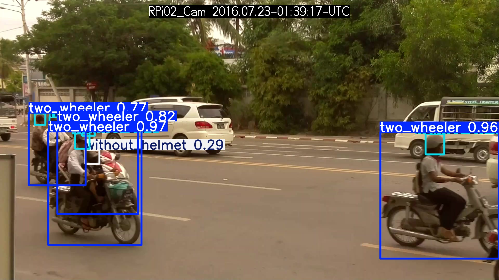
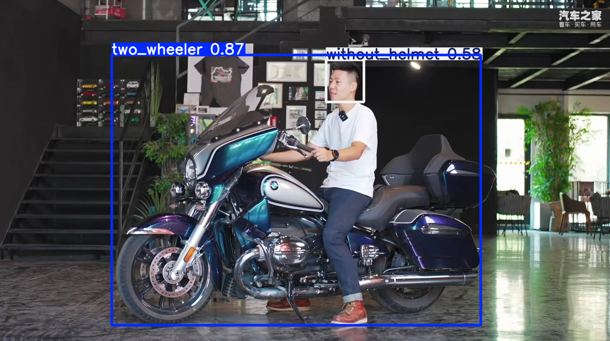
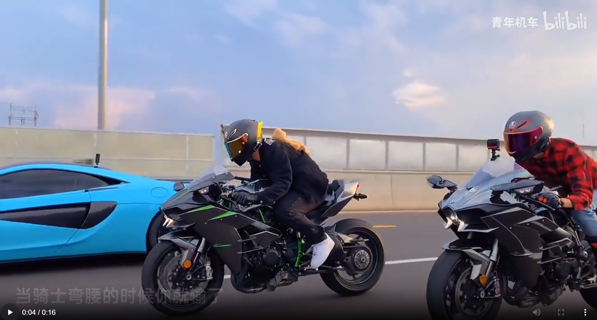
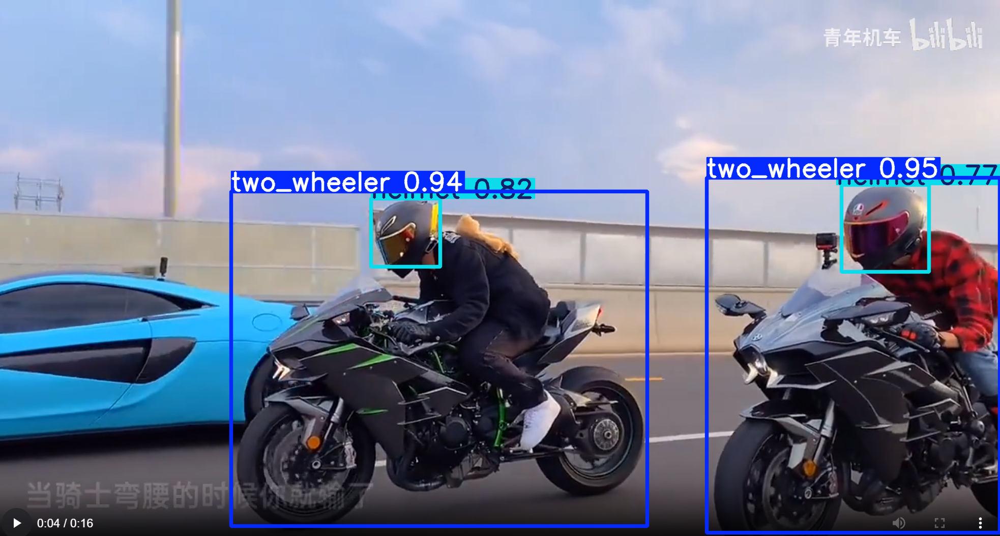

# 视觉实训小组 小组作业
组长：黄亮

组员：李肖洋，孙贺，冉鑫平，高庆，阳涵宇

小组分工

> TODO 


## 1. 安装环境

安装`conda`

> [linux](https://repo.anaconda.com/archive/Anaconda3-2024.06-1-Linux-x86_64.sh)
>
> [windows](https://repo.anaconda.com/archive/Anaconda3-2024.06-1-Linux-x86_64.sh)

创建`conda`环境

> ```shell
> conda create -n yolov8 python=3.8
> conda activate yolov8
> ```

一键安装依赖

> ```shell
> conda install -c pytorch -c nvidia -c conda-forge pytorch torchvision pytorch-cuda=11.8 ultralytics
> ```

## 2. 制作数据集

使用开源数据集[电动车佩戴头盔检测数据集（TWHD）](https://pan.baidu.com/share/init?surl=o9I4N4lORFGPD7ETm7C9_w&pwd=9xsz)

**TODO** 自己制作并且标记数据集

***

`dataset`数据集目录

> * `Annotations`文件夹：用来存放使用`labelimg`给每张图片标注后的xml文件。
> * `Images`文件夹：用来存放原始的需要训练的数据集图片，图片格式为jpg格式。
> * `ImageSets`文件夹：用来存放将数据集划分后的用于**训练**、**验证**、**测试**的文件。
> * `Labels`文件夹：用来存放将xml格式的标注文件转换后的txt格式的标注文件。

运行 `utils/split_train_val.py` 和 `utils/voc_label.py` 进行数据集划分

划分之后的结果


## 3. 训练

> 训练环境 `Ultralytics YOLOv8.2.86 🚀 Python-3.8.19 torch-2.4.0 CUDA:0 (NVIDIA A10, 22513MiB)`
> 
> 在 `BATCH_SIZE=32` 的情况下 `100 epochs completed in 4.229 hours.` 

`train.ipynb`

```python
from ultralytics import YOLO

# Load a model
model = YOLO("model/yolov8n.pt")  # load a pretrained model (recommended for training)

# Train the model
results = model.train(data="wheat.yaml", epochs=100， batch=32)
```

### 参数和加载


### 显存占用情况


### 训练过程


### VALIDATE


进行验证的原标签和预测对比


## 4.训练结果


## 5. 预测结果

### 图片

<center class="half">
    
    
</center>

<center class="half">
    
    
</center>

<center class="half">
    
    
</center>

<center class="half">
    
    
</center>

### 视频

原视频：`test/videos/origin/1.mp4`

训练之后的视频：`test/videos/pred/1_full.mp4`， `test/videos/pred/1_only_helmet.mp4`