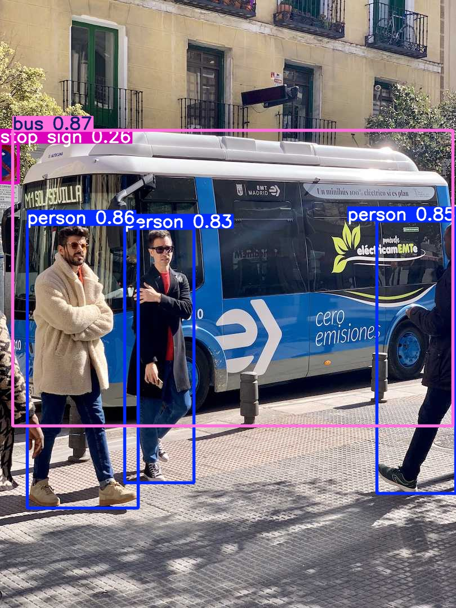

# 视觉实训小组 小组作业
组长：黄亮
组员：李肖洋，孙贺，冉鑫平，高庆，阳涵宇

小组分工

> TODO 

## 安装环境

安装conda

> [linux](https://repo.anaconda.com/archive/Anaconda3-2024.06-1-Linux-x86_64.sh)
>
> [windows](https://repo.anaconda.com/archive/Anaconda3-2024.06-1-Linux-x86_64.sh)

创建conda环境

> `conda create -n yolov8 python=3.8`
> 
> `conda activate yolov8`

一键安装依赖

> `conda install -c pytorch -c nvidia -c conda-forge pytorch torchvision pytorch-cuda=11.8 ultralytics`

***

运行`test.ipynb`， 可以看到效果图

